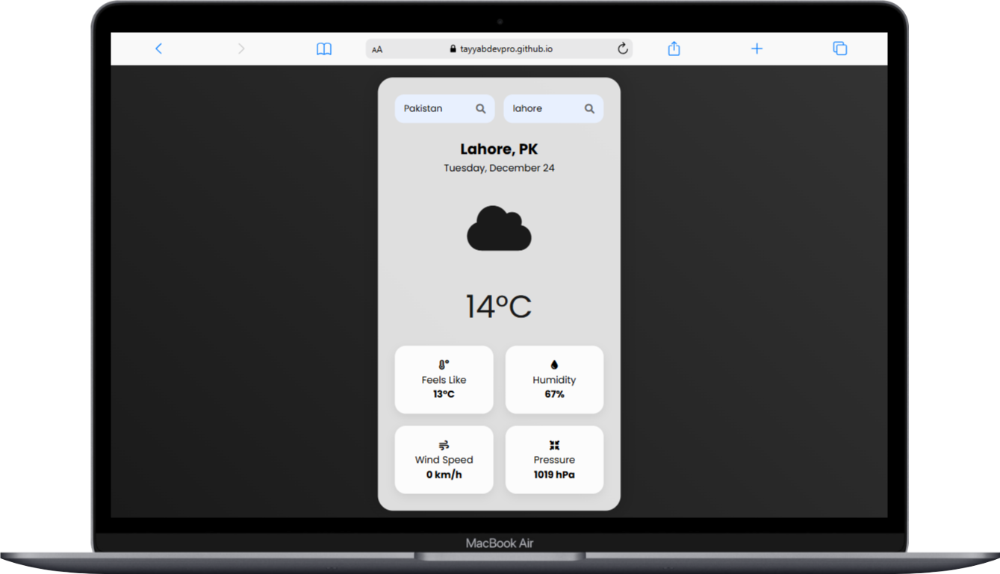

# 🌦️ Weather Application

A beautiful and responsive weather application that provides real-time weather information for cities worldwide. Built with HTML, CSS, and JavaScript, this application offers a sleek user interface and seamless weather data retrieval.

## ✨ Features

- 🌍 Country and city selection with smart search
- 🎯 Real-time weather updates
- 🌡️ Temperature and "feels like" information
- 💨 Wind speed monitoring
- 💧 Humidity levels
- 📊 Atmospheric pressure
- 🎨 Beautiful animated weather icons
- 📱 Fully responsive design

## 🚀 Live Demo

<div align="center">
  
  [](https://tayyabdevpro.github.io/Weather-Application/)
  
</div>

## 🛠️ Technologies Used

- HTML5
- CSS3
- JavaScript
- Font Awesome Icons
- OpenWeather API
- REST Countries API

## 📸 Screenshots



## 🌟 Key Features

- **Smart Search:** Real-time country and city search functionality
- **Detailed Weather Info:** Comprehensive weather data including temperature, humidity, wind speed, and pressure
- **Dynamic Icons:** Weather-specific icons that change based on current conditions
- **Responsive Design:** Seamless experience across all device sizes

## 💻 Installation

1. Clone the repository:
```bash
git clone https://github.com/your-username/Weather-Application.git
```

2. Navigate to the project directory:
```bash
cd Weather-Application
```

3. Open `index.html` in your browser

## 🤝 Contributing

Contributions, issues, and feature requests are welcome! Feel free to check the [issues page](https://github.com/your-username/Weather-Application/issues).

## 📝 License

This project is [MIT](LICENSE) licensed.

## 👨‍💻 Author

**Tayyab Dev**

- GitHub: [@tayyabdevpro](https://github.com/tayyabdevpro)

---

<div align="center">
  Made with ❤️ by Tayyab Dev
</div>
